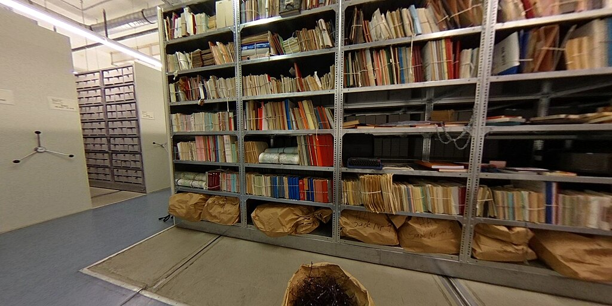

# About

---

::: {.grid}
::: {.g-col-8}

Privacy in Germany is governed by both national authorities and the European Union. For readers familiar with the United States, these rules may feel quite different but they shape how personal information is collected, shared, and used **both online and offline.**

Topics covered in this guide:

- **Public Filming & Photography:** When can you snap a photo, and when can't you?
- **Administrative Procedures:** What data does the government collect, and why?
- **Protests & Demonstrations:** Your rights and what to watch out for
- **Online Information Sharing:** What's allowed, what's not, and who enforces it

This guide provides a brief and friendly introduction to privacy practices and regulations in Germany. It explores the historical roots of privacy protection, outlines current laws, and looks into how these regulations shape everyday life.

:::
::: {.g-col-4}
{width=100%}
:::
:::

::: {.callout-note appearance="simple"}
**Disclaimer**: This document does not constitute legal advice. Readers are advised to verify and review any current regulations relevant to the subject matter, as requirements may have changed since *02/2026.*
:::

---

# Privacy Protection in the United States 

Legal definitions of privacy in the United States date back to the 1890 article **"The Right to Privacy"** by Samuel D. Warren II and Louis Brandeis; a landmark essay arguing that individuals deserve protection from unwanted public exposure. Existing laws of slander and libel, which focused on defamation, did not protect individuals from having private facts about themselves shared publicly. (Note: protections were applied differently to individuals of public interest.)

At the time the essay was published, the printing press and flash photography were beginning to spread rapidly. All of a sudden, private information about a person could be captured and distributed in a fixed, tangible form. What had once traveled through gossip or whispers within limited social circles could now be reproduced at scale and circulated across the country. 

Warren and Brandeis sought to address this shift directly. Their concept of privacy (sometimes described as simply *the right to be let alone*) was a response to a world in which the technology of the day had outpaced the law's ability to protect individuals from unwanted exposure.

But from those early roots, the United States developed a **patchwork** of federal, state, and local laws, each covering a specific sector or category of data.

::: {.callout-tip appearance="minimal"}
### Key U.S. Privacy Laws at a Glance

| Law | What it covers |
|-----|----------------|
| [HIPAA](https://www.hhs.gov/hipaa/for-professionals/privacy/laws-regulations/index.html) | Medical and health information |
| [COPPA](https://www.ftc.gov/legal-library/browse/rules/childrens-online-privacy-protection-rule-coppa) | Online data of children under 13 |
| [CCPA](https://oag.ca.gov/privacy/ccpa) | Consumer rights for California residents |
| [FERPA](https://studentprivacy.ed.gov/ferpa) | Student education records |

There is **no single federal law** that covers all personal data. Privacy protection coverage depends entirely on where you live and what kind of information is involved.
:::

While U.S. courts have recognized certain privacy interests under the Constitution (particularly against government intrusion) there is no general constitutional right to data protection comparable to the European framework. 

Outside of sector-specific laws, companies typically rely on user consent through **privacy policies and terms of service.** In practice, this often means passive or implied consent rather than explicit opt-in. Enforcement is typically handled by agencies such as the **Federal Trade Commission**, which focuses on unfair or deceptive business practices rather than enforcing a unified data protection code.

::: {.callout-note appearance="minimal"}
### Compared to Germany and the EU, U.S. data privacy is generally:
- Less centralized
- More dependent on state law
- More flexible for businesses
- More limited in guaranteed individual rights
:::

**In short: privacy protections do exist in the United States, but they are context-dependent rather than universal.**

---
# Privacy Protection in the European Union
---

In the European Union, individuals have a right to privacy *and* a separately codified right to data protection (enshrined in Article 8 of the EU Charter of Fundamental Rights.) Unlike the United States, the EU has adopted a **comprehensive and unified regulatory framework** that applies across all 27 member states.

The central law governing personal data is the [**General Data Protection Regulation (GDPR)**](https://gdpr.eu/what-is-gdpr/). Enacted in 2018, the GDPR:

- Establishes uniform rules for how personal data is collected, processed, stored, and transferred
- Grants individuals **enforceable rights** over their own data
- Imposes significant obligations on any organization that handles personal information, including non-EU companies that serve EU residents

::: {.callout-note appearance="minimal"}
### The Broader EU Digital Regulatory Ecosystem

The GDPR doesn't stand alone. The EU has built a broader framework of digital governance:

- **Digital Services Act (DSA):** Strengthens accountability for online platforms and enhances user protections
- **AI Act:** A risk-based regulatory system for artificial intelligence, with safeguards for fundamental rights
- **Digital Markets Act (DMA):** Targets anti-competitive practices by major tech platforms.

Together, these laws reflect an EU philosophy that digital life should be governed by **rights, accountability, and transparency.** Not just market forces.
:::

In Germany, these European frameworks serve as a **baseline**. Germany applies EU law directly while also maintaining national provisions that can further strengthen how data protection is implemented domestically.

---

# Privacy in Germany: Regulations & Practices

---

As mentioned above, EU data protections are defined by the [**GDPR**](https://gdpr.eu/what-is-gdpr/). But in the GDPR's opening clauses, member states are permitted to tailor protections further. Germany takes full advantage of this through the **Bundes­daten­schutz­gesetz (BDSG)**, also known as the Federal Data Protection Act, supplements the GDPR at the national level.

Together, the GDPR and BDSG form the legal backbone for privacy in Germany and they shape daily life in some surprisingly concrete ways.

---

## Historical Influences

Germany's intense commitment to privacy didn't emerge from abstract legal theory. It grew directly from lived historical trauma.

::: {.grid}
::: {.g-col-6}

### The Nazi Era (1933–1945)

The Gestapo (Geheime Staatspolizei), the official secret police of Nazi Germany and German-occupied Europe, relied heavily on denunciations from ordinary citizens to sustain its reach. Through population registries, census records, and informant networks, the National Socialist regime demonstrated with devastating clarity what happens when a state gains unrestricted access to personal data. 

For Jewish people in Nazi Germany, privacy violations were inseparable from the antisemitic legal framework of the regime. A succession of laws stripped individuals of their rights across every dimension of life: exclusion from social services, removal from professional roles, prohibitions on marriage, all part of the broader and ongoing genocide.

The experience left a deep and lasting imprint on the German legal psyche: **data, in the wrong hands, can be a weapon.**

:::
::: {.g-col-6}

### The Stasi & East Germany (1949–1990)

The Ministerium für Staatssicherheit (the Stasi) is considered one of the most comprehensive surveillance organizations in history. Founded in 1950, the Stasi functioned as East Germany's secret police, tasked with monitoring and suppressing any perceived opposition to the state. It operated through a combination of full-time employees and a vast network of informal collaborators. For example, ordinary citizens recruited or coerced to inform the stasi on their neighbors, friends, and even family members. 

Overall, millions of files documented individuals' movements, relationships, and private lives in extraordinary detail. When the Berlin Wall fell in 1989, citizens stormed Stasi headquarters to prevent the destruction of those records. Today, some of these files are accessible to victims. [(Further Reading)](https://www.dw.com/en/east-germany-spy-agency-stasi-surveillance/a-73491436)

:::
:::

::: {.callout-important appearance="minimal"}
### The 1983 Census Ruling: A Turning Point

In 1983, the German Federal Constitutional Court issued a landmark ruling in the **Volkszählungsurteil** (Census Judgment). The court declared that individuals have a constitutionally protected right to **"informational self-determination"**. The right to decide for themselves what personal data is shared, with whom, and for what purpose.

This was a world-first. It became the philosophical and legal foundation for modern German (and eventually European) data protection law.
:::

<!-- {width=100%} -->

{width=80%}

---

## Common Practices: How Privacy Shapes Everyday Life in Germany

Privacy in Germany isn't just a legal concept, it's a **cultural value.** Here's how it plays out in situations you're likely to encounter.

---

### Photography & Filming in Public

Germany has some of the strictest rules around photography of people in the EU, rooted in the **Kunsturhebergesetz (KUG)**, a law from *1907* that has been updated for the digital age.

::: {.grid}
::: {.g-col-6}

**Generally allowed**

- Landscapes, cityscapes, and architecture
- Public figures *in their public roles* (politicians at rallies, performers on stage)
- Crowds at public events, where individuals are **incidental** to the scene

:::
::: {.g-col-6}

**Generally not allowed**

- Identifiable close-up photos of private individuals without consent
- Photos taken in private spaces (gardens, through windows)
- Publishing or sharing images of someone in a way that damages their reputation

:::
:::

::: {.callout-tip appearance="minimal"}
### Group Photos: A Common Point of Confusion

Taking a spontaneous group selfie with friends in a public square? Usually fine. Posting it online with all their faces clearly visible? You may need their consent under German and EU law, especially if posted on public platforms. **Always ask first before you share**
:::

---

### Webcams & Surveillance Cameras

Unlike many countries where CCTV cameras are nearly invisible in daily life, surveillance camera usage in Germany is comparatively limited, especially by private individuals and businesses.

- **Shops and businesses** may use cameras but must post visible signs (you have likely seen the small stickers: *"Videoüberwachung"*)
- **Pointing a camera at your neighbor's property** even accidentally can be illegal
- **Smart doorbells** (like Ring) with wide-angle cameras that capture public sidewalks or neighboring properties have led to legal disputes

{height=70%}

---

### Administrative Procedures & the *Meldepflicht*

One aspect of German privacy law that surprises many newcomers: **you are legally required to register your address** with the local government (*Einwohnermeldeamt*) within two weeks of moving, including from abroad.

This is called the ***Meldepflicht*** (registration obligation), and it applies to everyone living in Germany, not just citizens. the Meldepflicht reflects a different aspect of German governance: administrative efficiency and civic accountability. Interestingly, the same law that requires registration also **limits what the government can do with that data** 

---

### Protests & Demonstrations

Germany has a strong tradition of public protest, protected under **Article 8 of the Basic Law** (*Grundgesetz*). But privacy intersects with protest rights in important ways:

- Police may **not photograph protesters** in a way that deters participation. This was affirmed in several court decisions
- If you are photographed at a protest and the image is published, you may have legal recourse
- Undercover surveillance of protests is strictly regulated

---

### Online Information Sharing

German and EU law also has specific rules about what you can share about others online:

- **Doxing** (Z.b. publishing someone's private contact information without consent) is a criminal offense under German law
- **Fake reviews** that damage a business's reputation can be grounds for legal action
- **Right to erasure ("right to be forgotten")**: Under the GDPR, you can request that search engines and platforms delete outdated or harmful information about you

**A note on social media**

Posting photos of friends at a party, tagging their location, or sharing information about their lives without asking may seem harmless but in Germany, it can technically violate their privacy. **ALWAYS ASK BEFORE.**

---

## Watch: How Germans Experience Privacy



*Easy German interviews people on the street about how they think about privacy in everyday life.

---

## Practical Advice for Newcomers

Overall, If you are new to Germany, here are a few things to keep in mind:

::: {.grid}
::: {.g-col-6}

**Your rights**

- You have the right to know what data companies hold about you and the right to request it
- You can request deletion of your data under the GDPR's *right to erasure*
- You do not have to agree to data collection beyond what is strictly necessary for a service

:::
::: {.g-col-6}

**Respecting others' privacy**

- Ask before photographing someone in a non-public setting
- Don't share personal details about others online without their consent
- Be aware that your doorbell camera or home security system may have legal implications for your neighbors

:::
:::

### Where to Go for Help

- **Bundesbeauftragte für den Datenschutz und die Informationsfreiheit (BfDI):** Germany's Federal Commissioner for Data Protection: [bfdi.bund.de](https://www.bfdi.bund.de)
- **Your state's data protection authority (Landesdatenschutzbeauftragter):** Each German state has its own authority

---

# Sources & Additional Resources

---

**Legal Texts**

- [GDPR Full Text (gdpr.eu)](https://gdpr.eu/what-is-gdpr/)
- [Federal Data Protection Act – BDSG (English)](https://www.gesetze-im-internet.de/englisch_bdsg/)
- [Basic Law for the Federal Republic of Germany (Grundgesetz)](https://www.gesetze-im-internet.de/englisch_gg/)

**Further Reading**

- "The Right to Privacy", Samuel D. Warren II and Louis Brandeis (1890)
- *Volkszählungsurteil* (Census Judgment), BVerfG, 1983
- [The Stasi Records Archive (BStU)](https://www.stasi-unterlagen-archiv.de/en/)
- [Stasi: How the GDR kept its citizens under surveillance, DW](https://www.youtube.com/watch?v=Assdm6fIHlE)

**Video**

- [Are Germans Paranoid About Privacy? | Easy German 519](https://youtu.be/UXe5aZ2eDFY?si=wWfJB8w9rkf3L51e)
- [What is the GDPR](https://www.youtube.com/watch?v=Assdm6fIHlE)

---

::: {.callout-note appearance="minimal"}
*This guide was written as an accessible introduction for English-speaking readers. It does not constitute legal advice. Laws change. Aways verify current requirements with a qualified legal professional or official government source.*
:::
