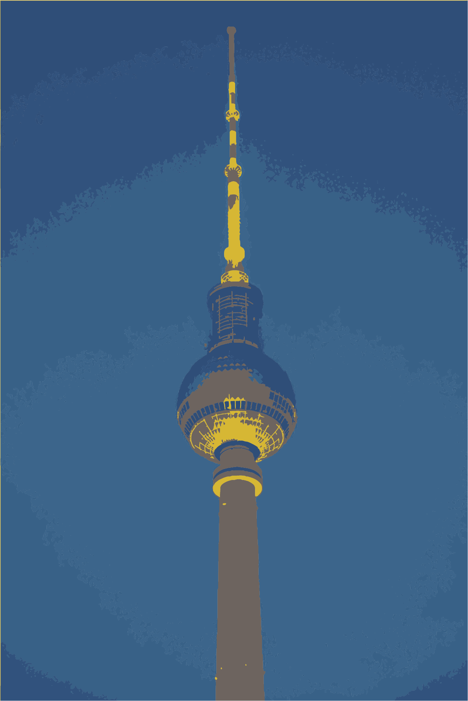

[Privacy in Germany]{.site-heading}

# About 
***
::: {.grid}
::: {.g-col-8}
Privacy in Germany is governed by both national authorities and the European Union. For readers familiar with the United States, these rules may feel quite different, as they influence how personal information is collected, shared, and used—**both online and offline.**

For example: 

* Public Filming & Photography
* Administrative Procedures
* Protests & Demonstrations
* Online Information Sharing

This guide provides a brief and friendly introduction to privacy practices and regulations in Germany. It explores the historical roots of privacy protection, outlines current laws, and looks into how these regulations shape everyday life.

:::
::: {.g-col-4}

{width=100%}
::: 
:::

# Privacy Protection in the United States
***

Through a patchwork of federal, state, and locals laws, in the United States there exists

Like the European Union, the United States varies laws and legal interpretations argues that individuals have a right to privacy. It is not 

In the United States, data and privacy protections are passively consented and under less regulation than in Germany and the European Union.

There is ome

Online, when you are creating an account, using a web service, or simply just scrolling, there is information about you that is being collected by the website. In many instances, third-party entities may gain access to this information. 

In fact, its much of an afterthought in public, as filming and photography public spaces is met with less care.

Data from these sites can be further aggregated into other datasets, or stored for future use. Given how cheap and expansive data storage has become in the last decade, Information about you can be retained.

With the exception of the California Consumer Privacy Act of 2018 (CCPA), Online Privacy Protection in the United States is limited. The closed things to data privacy is the Health Insurance Portability and Accountability Act (HIPAA) of 1996, which applies to Health Information.

Sometimes, simpling clicking on an ad link can give a wesbite access to you. It is a sort of passive consent -- 'by using are website you are agreeing to our privacy policy' something that most people don't read or dismiss-- again, it is quite passive.

In the EU Data and Privacy Protections are defined by the [[General Data Protection Regulation (GDPR)](https://gdpr.eu/what-is-gdpr/)]{.highlight-text}
In the opening clauses of the GDPR, EU members are able to tailor protections. 

In Germany, the Bundes­daten­schutz­gesetz (BDSG), also known as the Federal Data Protection Act supplements the GDPR at the National level.

Together the GDPR and the  BDSG serve as the base for 

---
To learn more about Quarto websites visit <https://quarto.org/docs/websites>.
